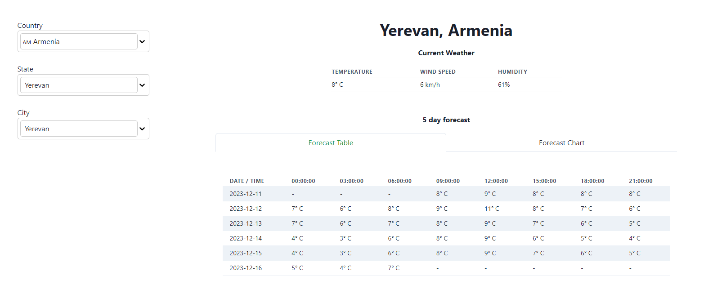
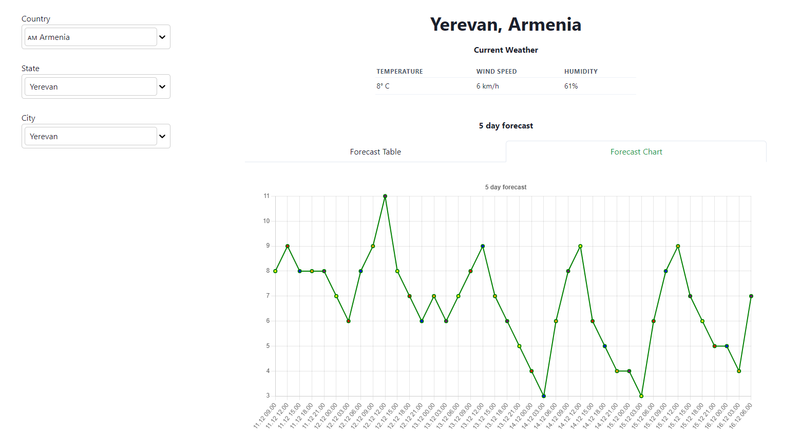
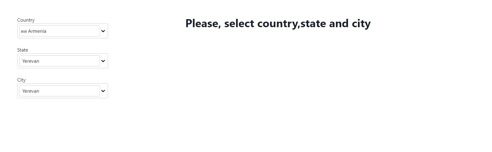

# Weather App

Weather App is a web application that allows users to get information about current 
weather and weather forecast for 5 days.

When you first load the application using your browser, your location is determined 
and, by your current location, the current weather and 5-day weather forecast for this 
location are determined.

Based on data received from the API, the application displays a table and graph of the
weather forecast of the current location for 5 days.

## Features and Implementation

### Tab with a 5-day weather forecast table

This tab displays the weather forecast for 5 days in table form.

### Tab with a 5-day weather forecast chart

This tab displays the weather forecast for 5 days in the form of a graph.

### Location Form

This form is used to select a country, state (province, region) and city and then 
display the current weather and 5-day weather forecast manually.